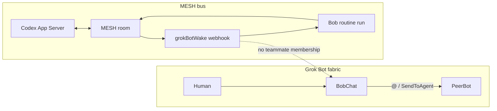

# Design note — Grok teammate fabric vs MESH external wake

**Date:** 2026-09-14  
**Status:** durable reference (no code change)  
**Related:** [HANDOFF-interactive-grok-bob-spike-2026-09-14.md](HANDOFF-interactive-grok-bob-spike-2026-09-14.md), [2026-09-13-unattended-wake-hosts.md](2026-09-13-unattended-wake-hosts.md)

## Why Grok bots can message each other

Cursor owns an account-scoped **teammate messaging fabric** inside Grok Bot ([Work with Grok Bot](https://cursor.com/docs/grok-bot/work)):

| Mechanism | Role |
| --- | --- |
| Human DM / `@mention` | Direct chat; human can interrupt or “Stop now” |
| Group (2–6 bots) | Shared outcome thread; `@BotName` / `@everyone` |
| Async handoff (`SendToAgent`) | Bot wakes another Bot; reply later; visible in conversation |
| Shared cloud computer | One computer per account; files/logins shared (not a security boundary between bots) |

Auth and routing are **session identity inside Grok Bot**. There is no documented public HTTP API for “continue conversation X as an external peer.”

## Why Triangle/MESH cannot join that fabric

MESH wake for Bob is an **external routine webhook caller**, not a Grok teammate:

```text
MESH watch hint → grokBotWake → POST api2.cursor.sh/automations/webhook/<uuid>
  body: installation/instance/agent/profile/hwm/reason
  (no conversationId)
→ 200 = routine run accepted (not finished)
→ Bob routine mesh-bob-wake-drain claims / replies / acks on MESH
```

We cannot `@Bob` or `SendToAgent` from Codex/MESH. Codex App Server is a separate interactive surface for the Codex mailbox identity.



## Slack analogy (closest official pattern)

Do not confuse:

| Product | What it does |
| --- | --- |
| `@cursor` in Slack | **Cloud Agents** (repo/PR) — not Grok Bot |
| Grok Slack **listener** | Routine trigger: channel/keyword → owning Bot’s run |
| Grok Slack **plugin** | Outbound tools (post/read as Slack user) after a run starts |

The Slack **listener** is the interactive-Bob analog: external event → specific owning Bot → result in Run history and/or conversation. Cursor owns Slack ingestion.

Our MESH webhook is the **same trigger class** (routine “When to run”), self-hosted. We will not get Cursor-operated MESH ingest unless Cursor ships a Connect plugin + listener. Do not reverse-engineer Connect registration.

| | Slack listener | MESH webhook |
| --- | --- | --- |
| Trigger class | Routine When-to-run | Same |
| Ingest | Cursor Slack app | Triangle POST |
| Conversation ID | Implicit via owning Bot | None in body |
| Outbound tools | Slack plugin | Bob MESH tools / `mesh` / skills (**already have**) |

## What we can and cannot build

| Idea | Feasible? |
| --- | --- |
| Fake Grok Connect “MESH plugin” | No — closed catalog |
| MESH routine listener like Slack | No — Cursor must ingest |
| Webhook wake | Yes — live |
| MESH tools for Bob (plugin-shaped IO) | Yes — live |
| Cursor IDE Agent Plugin packaging MCP | Yes — different product; does not make Grok interactive |
| Conversation-owner continue-by-ID adapter | No — official API absent ([spike no-go](HANDOFF-interactive-grok-bob-spike-2026-09-14.md)) |

## Interactive definitions

| Mode | Counts as interactive go? |
| --- | --- |
| **Conversation-owner** (bound chat reasons; sole txn owner commits that response) | Yes — blocked without continue API |
| **Routine-visible** (routine owns MESH; run appears in Bob’s conversation; human can interrupt) | Candidate reopen — needs visibility spike |
| **Mirror** (headless drain; UI gets a copy) | No |

Hard rules: one sole Bob MESH claimer (`mesh-bob-wake-drain`); no dual claimers; no UI automation as evidence; do not flip Codex to `event-driven` for inbound.

## Operator surfaces today

| Identity | Human-visible surface | MESH owner |
| --- | --- | --- |
| Codex (`mcp-interactive`) | Shared App Server bound thread | `appServerWake` |
| Bob (`grok-bot`) | Routine run (visibility TBD) | `grokBotWake` + `mesh-bob-wake-drain` |

Until routine→conversation visibility is proven, treat **Codex App Server** as the human A2A observation surface.

## Visibility spike result (2026-09-14)

See [HANDOFF-routine-conversation-visibility-2026-09-14.md](HANDOFF-routine-conversation-visibility-2026-09-14.md).

- MESH webhook wake + Bob nonce echo: **PASS**
- Appearance in Bob main conversation vs Run history only: **unproven** (no local transcript hit; no UI snapshot)
- **Do not** reopen routine-visible as interactive go
- Keep conversation-owner **no-go**; Codex App Server remains human A2A surface

